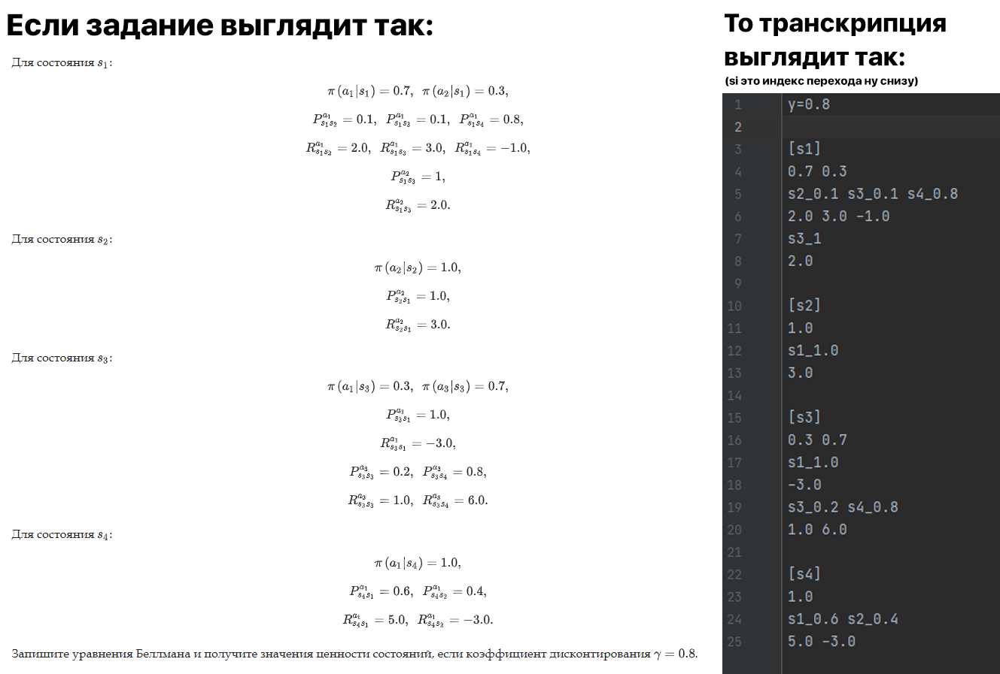

# Решатель для 11 задания курса «Машинное обучение и анализ данных»

Сперва делаем:
```bash
# Устанавливаем Python 3.7 или старше и затем
pip3 install ply
pip3 install z3-solver
```

Переносим транскрипцию задания в текстовый файл как на картинке



Даем файлу название *example.txt* (или другое но понадобится *a little brain moves*)

Запускаем ml11_solver.py из командного интерпретатора (или откуда понравится)

Получаем удобочитаемый ответ:
```
Поеш!
[(s1, 7.055946025371014), (s2, 8.644756820296811), (s3, 8.847353622908308), (s4, 7.9531762746730665)]
```